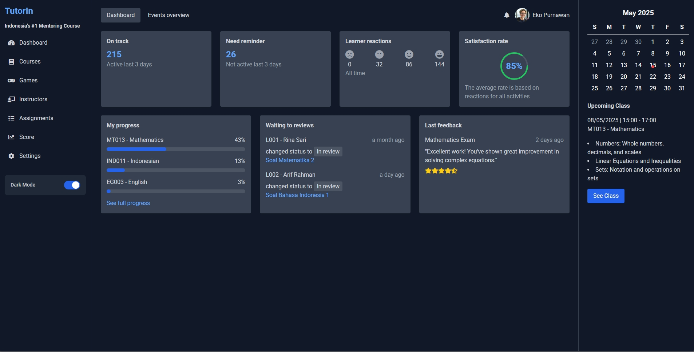

# TutorIn

TutorIn adalah aplikasi web yang mempertemukan siswa dengan tutor secara online. Platform ini memungkinkan pengguna untuk mencari tutor, melakukan booking sesi belajar, dan berinteraksi melalui sistem yang user-friendly dan efisien.

---

## 🚀 Fitur Utama

- 🔐 Autentikasi pengguna (login/register)
- 🧑‍🏫 Profil tutor dan pencarian berdasarkan bidang
- 📅 Booking sesi belajar
- 💬 Notifikasi email (opsional)
- 🎮 Games

---

## 🖼️ Tampilan Aplikasi

> 

---

## ⚙️ Struktur Proyek

---

### 🔧 Prasyarat

- Docker dan Docker Compose sudah terinstal di komputer

### ▶️ Jalankan Aplikasi

```bash
docker-compose up --build
```

---

### 🔍 File docker-compose.yml mengatur:
- Frontend pada port 3000
```bash
Frontend: http://localhost:3000
```
- Backend pada port 5000
```bash
Backend: http://localhost:5000
```

---

### 👨‍💻 Kontributor
- @wildaaaann – Developer TutorIn

---

### 📜 Lisensi
- Proyek ini dapat digunakan secara bebas untuk keperluan pembelajaran dan pengembangan.

---


